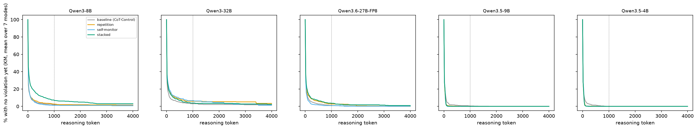

# exp03_abort_survival: automated report (UNVERIFIED)

Run main. Primary: Kaplan-Meier S(1000): share of traces with no rule violation in their first 1000 reasoning tokens (a trace that ends earlier without a violation is censored at its length), per (model, prompt, mode) cell, averaged over the 7 abortable modes; each Arun prompt minus baseline per model, question-level bootstrap paired across prompts, Holm correction over the 9 contrasts.

## Primary: S(t*) and prompt - baseline (points, 95% CI)

| model | prompt | S(t*) | reached t* | P1 | P2 (judge) | P2_regex | accuracy, full traces | aborted % | censored < t* % |
|---|---|---|---|---|---|---|---|---|---|
| Qwen3-8B | baseline | 1.9 [1.0, 3.1] | 1.6 [0.7, 2.6] | 1.3 [0.6, 2.1] | 1.3 [0.6, 2.1] | 1.3 [0.6, 2.1] | 39.2 [32.6, 46.4] | 73.3 | 0.6 |
| Qwen3-8B | repetition | 2.6 [1.4, 4.0] | 1.6 [0.7, 2.6] | 2.1 [1.1, 3.1] | 2.1 [1.1, 3.1] | 2.1 [1.1, 3.1] | 37.9 [31.3, 45.0] | 72.7 | 1.6 |
| Qwen3-8B | self_monitor | 1.2 [0.3, 2.0] | 0.6 [0.1, 1.1] | 1.2 [0.6, 1.9] | 1.2 [0.6, 1.9] | 1.2 [0.6, 1.9] | 37.9 [31.5, 44.4] | 73.7 | 1.0 |
| Qwen3-8B | stacked | 7.0 [5.1, 9.0] | 5.3 [3.6, 7.0] | 4.8 [3.6, 6.1] | 4.8 [3.6, 6.1] | 4.6 [3.4, 5.9] | 41.6 [35.7, 48.2] | 69.7 | 3.1 |
| Qwen3-32B | baseline | 3.0 [1.9, 4.5] | 1.7 [0.9, 2.7] | 2.8 [1.8, 3.8] | 2.4 [1.4, 3.5] | 2.5 [1.5, 3.6] | 48.0 [41.8, 54.3] | 72.6 | 2.0 |
| Qwen3-32B | repetition | 5.9 [4.1, 7.9] | 2.4 [1.3, 3.6] | 5.4 [4.0, 6.8] | 5.3 [4.0, 6.6] | 5.4 [4.0, 6.8] | 47.5 [41.3, 53.6] | 69.3 | 4.9 |
| Qwen3-32B | self_monitor | 6.5 [4.3, 8.8] | 2.0 [1.0, 3.0] | 6.6 [4.9, 8.3] | 6.1 [4.6, 7.8] | 6.1 [4.5, 7.8] | 48.8 [42.0, 55.6] | 67.9 | 6.7 |
| Qwen3-32B | stacked | 3.8 [2.3, 5.5] | 2.3 [1.3, 3.4] | 4.7 [3.5, 6.0] | 4.3 [3.2, 5.6] | 4.5 [3.3, 5.8] | 48.5 [42.7, 54.1] | 70.6 | 3.4 |
| Qwen3.6-27B-FP8 | baseline | 1.1 [0.3, 2.1] | 1.0 [0.3, 2.0] | 0.1 [0.0, 0.4] | 0.0 [0.0, 0.0] | 0.0 [0.0, 0.0] | 54.4 [47.3, 61.3] | 74.7 | 0.1 |
| Qwen3.6-27B-FP8 | repetition | 2.7 [1.7, 4.7] | 2.1 [1.1, 3.1] | 1.9 [0.9, 3.1] | 0.5 [0.1, 1.0] | 0.1 [0.0, 0.3] | 52.5 [46.1, 59.1] | 73.3 | 1.4 |
| Qwen3.6-27B-FP8 | self_monitor | 0.9 [0.3, 1.6] | 0.7 [0.1, 1.4] | 0.4 [0.0, 0.9] | 0.0 [0.0, 0.0] | 0.0 [0.0, 0.0] | 52.0 [45.8, 58.1] | 74.7 | 0.1 |
| Qwen3.6-27B-FP8 | stacked | 3.5 [2.3, 4.8] | 2.1 [1.1, 3.3] | 2.5 [1.5, 3.5] | 1.3 [0.5, 2.1] | 1.1 [0.4, 2.0] | 54.1 [46.5, 61.6] | 73.4 | 2.0 |
| Qwen3.5-9B | baseline | 0.4 [0.0, 1.0] | 0.4 [0.0, 1.0] | 0.0 [0.0, 0.0] | 0.0 [0.0, 0.0] | 0.0 [0.0, 0.0] | 48.5 [42.4, 54.5] | 75.0 | 0.0 |
| Qwen3.5-9B | repetition | 0.0 [0.0, 0.0] | 0.0 [0.0, 0.0] | 0.0 [0.0, 0.0] | 0.0 [0.0, 0.0] | 0.0 [0.0, 0.0] | 48.5 [41.9, 55.1] | 75.0 | 0.0 |
| Qwen3.5-9B | self_monitor | 0.0 [0.0, 0.0] | 0.0 [0.0, 0.0] | 0.0 [0.0, 0.0] | 0.0 [0.0, 0.0] | 0.0 [0.0, 0.0] | 46.7 [39.8, 53.5] | 75.0 | 0.0 |
| Qwen3.5-9B | stacked | 0.0 [0.0, 0.0] | 0.0 [0.0, 0.0] | 0.0 [0.0, 0.0] | 0.0 [0.0, 0.0] | 0.0 [0.0, 0.0] | 48.8 [42.3, 55.3] | 75.0 | 0.0 |
| Qwen3.5-4B | baseline | 0.0 [0.0, 0.0] | 0.0 [0.0, 0.0] | 0.0 [0.0, 0.0] | 0.0 [0.0, 0.0] | 0.0 [0.0, 0.0] | 46.4 [39.6, 53.3] | 75.0 | 0.0 |
| Qwen3.5-4B | repetition | 0.0 [0.0, 0.0] | 0.0 [0.0, 0.0] | 0.0 [0.0, 0.0] | 0.0 [0.0, 0.0] | 0.0 [0.0, 0.0] | 46.4 [39.4, 52.9] | 75.0 | 0.0 |
| Qwen3.5-4B | self_monitor | 0.0 [0.0, 0.0] | 0.0 [0.0, 0.0] | 0.0 [0.0, 0.0] | 0.0 [0.0, 0.0] | 0.0 [0.0, 0.0] | 46.9 [39.7, 53.9] | 75.0 | 0.0 |
| Qwen3.5-4B | stacked | 0.0 [0.0, 0.0] | 0.0 [0.0, 0.0] | 0.0 [0.0, 0.0] | 0.0 [0.0, 0.0] | 0.0 [0.0, 0.0] | 45.1 [38.6, 51.4] | 75.0 | 0.0 |

Holm correction within each outcome and family: pre-registered (the manifest's 9 contrasts) and extension (Qwen3.5-9B, Qwen3.5-4B, added after the manifest).

| model | family | prompt | outcome | difference | p | p (Holm, within family) |
|---|---|---|---|---|---|---|
| Qwen3-8B | pre-registered | repetition | survival | 0.6 [-0.8, 2.0] | 0.329 | 0.987 |
| Qwen3-8B | pre-registered | repetition | reached | 0.0 [-1.1, 1.1] | 1.000 | 1.000 |
| Qwen3-8B | pre-registered | self_monitor | survival | -0.8 [-2.1, 0.5] | 0.168 | 0.672 |
| Qwen3-8B | pre-registered | self_monitor | reached | -1.0 [-2.0, 0.0] | 0.057 | 0.456 |
| Qwen3-8B | pre-registered | stacked | survival | 5.1 [2.9, 7.2] | 0.001 | 0.009 |
| Qwen3-8B | pre-registered | stacked | reached | 3.7 [2.0, 5.6] | 0.001 | 0.009 |
| Qwen3-32B | pre-registered | repetition | survival | 2.9 [0.4, 5.2] | 0.024 | 0.120 |
| Qwen3-32B | pre-registered | repetition | reached | 0.7 [-0.7, 2.1] | 0.344 | 1.000 |
| Qwen3-32B | pre-registered | self_monitor | survival | 3.5 [0.9, 5.9] | 0.008 | 0.056 |
| Qwen3-32B | pre-registered | self_monitor | reached | 0.3 [-1.1, 1.7] | 0.800 | 1.000 |
| Qwen3-32B | pre-registered | stacked | survival | 0.8 [-1.3, 2.8] | 0.506 | 1.000 |
| Qwen3-32B | pre-registered | stacked | reached | 0.6 [-0.7, 1.9] | 0.433 | 1.000 |
| Qwen3.6-27B-FP8 | pre-registered | repetition | survival | 1.6 [0.4, 3.6] | 0.014 | 0.084 |
| Qwen3.6-27B-FP8 | pre-registered | repetition | reached | 1.1 [-0.1, 2.3] | 0.079 | 0.553 |
| Qwen3.6-27B-FP8 | pre-registered | self_monitor | survival | -0.2 [-1.4, 0.9] | 0.729 | 1.000 |
| Qwen3.6-27B-FP8 | pre-registered | self_monitor | reached | -0.3 [-1.4, 0.7] | 0.685 | 1.000 |
| Qwen3.6-27B-FP8 | pre-registered | stacked | survival | 2.4 [1.0, 3.9] | 0.001 | 0.009 |
| Qwen3.6-27B-FP8 | pre-registered | stacked | reached | 1.1 [-0.0, 2.4] | 0.082 | 0.553 |
| Qwen3.5-9B | extension | repetition | survival | -0.4 [-1.0, 0.0] | 0.095 | 0.570 |
| Qwen3.5-9B | extension | repetition | reached | -0.4 [-1.0, 0.0] | 0.095 | 0.570 |
| Qwen3.5-9B | extension | self_monitor | survival | -0.4 [-1.0, 0.0] | 0.095 | 0.570 |
| Qwen3.5-9B | extension | self_monitor | reached | -0.4 [-1.0, 0.0] | 0.095 | 0.570 |
| Qwen3.5-9B | extension | stacked | survival | -0.4 [-1.0, 0.0] | 0.095 | 0.570 |
| Qwen3.5-9B | extension | stacked | reached | -0.4 [-1.0, 0.0] | 0.095 | 0.570 |
| Qwen3.5-4B | extension | repetition | survival | 0.0 [0.0, 0.0] | 1.000 | 1.000 |
| Qwen3.5-4B | extension | repetition | reached | 0.0 [0.0, 0.0] | 1.000 | 1.000 |
| Qwen3.5-4B | extension | self_monitor | survival | 0.0 [0.0, 0.0] | 1.000 | 1.000 |
| Qwen3.5-4B | extension | self_monitor | reached | 0.0 [0.0, 0.0] | 1.000 | 1.000 |
| Qwen3.5-4B | extension | stacked | survival | 0.0 [0.0, 0.0] | 1.000 | 1.000 |
| Qwen3.5-4B | extension | stacked | reached | 0.0 [0.0, 0.0] | 1.000 | 1.000 |



P2 uses the LLM judge (Qwen3.8-27B-FP8) and is weaker evidence than the grader-based S(t*), reached-t* and P1.

## Secondary: pooled with exp02 (150 items; models exp02 completed)

| model | prompt | S(t*) | P1 |
|---|---|---|---|
| Qwen3-8B | baseline | 2.0 [1.2, 2.9] | 1.1 [0.6, 1.7] |
| Qwen3-8B | repetition | 2.5 [1.6, 3.6] | 1.8 [1.1, 2.6] |
| Qwen3-8B | self_monitor | 1.5 [0.8, 2.4] | 1.1 [0.6, 1.7] |
| Qwen3-8B | stacked | 7.9 [6.3, 9.5] | 5.1 [4.1, 6.2] |
| Qwen3-32B | baseline | 3.2 [2.1, 4.6] | 2.9 [2.0, 3.9] |
| Qwen3-32B | repetition | 5.6 [4.1, 7.1] | 4.9 [3.8, 5.9] |
| Qwen3-32B | self_monitor | 6.5 [4.8, 8.3] | 6.3 [4.9, 7.6] |
| Qwen3-32B | stacked | 4.2 [3.0, 5.6] | 4.6 [3.6, 5.6] |

| model | prompt | outcome | difference | p (Holm, 9) |
|---|---|---|---|---|
| Qwen3-8B | repetition | survival | 0.5 [-0.7, 1.7] | 0.819 |
| Qwen3-8B | repetition | reached | -0.3 [-1.2, 0.7] | 0.910 |
| Qwen3-8B | self_monitor | survival | -0.5 [-1.6, 0.6] | 0.819 |
| Qwen3-8B | self_monitor | reached | -0.9 [-1.7, 0.1] | 0.395 |
| Qwen3-8B | stacked | survival | 5.9 [4.2, 7.7] | 0.006 |
| Qwen3-8B | stacked | reached | 4.2 [2.6, 5.7] | 0.006 |
| Qwen3-32B | repetition | survival | 2.4 [0.4, 4.3] | 0.068 |
| Qwen3-32B | repetition | reached | 0.7 [-0.4, 1.8] | 0.896 |
| Qwen3-32B | self_monitor | survival | 3.3 [1.4, 5.2] | 0.006 |
| Qwen3-32B | self_monitor | reached | 0.8 [-0.5, 1.9] | 0.896 |
| Qwen3-32B | stacked | survival | 1.0 [-0.8, 2.7] | 0.819 |
| Qwen3-32B | stacked | reached | 0.5 [-0.6, 1.7] | 0.910 |

## Abort audit (full-trace cells)

3500 full traces, 3452 violating, 3451 would have been aborted, 0 false or unstable firings.

| model | prompt | P1 aborting cells | P1 full-trace cells |
|---|---|---|---|
| Qwen3-32B | baseline | 3.2 | 1.7 |
| Qwen3-32B | repetition | 7.0 | 5.1 |
| Qwen3-32B | self_monitor | 8.6 | 4.6 |
| Qwen3-32B | stacked | 5.5 | 2.9 |
| Qwen3-8B | baseline | 1.9 | 0.6 |
| Qwen3-8B | repetition | 2.9 | 1.7 |
| Qwen3-8B | self_monitor | 1.5 | 0.6 |
| Qwen3-8B | stacked | 6.3 | 3.4 |
| Qwen3.5-4B | baseline | 0.0 | 0.0 |
| Qwen3.5-4B | repetition | 0.0 | 0.0 |
| Qwen3.5-4B | self_monitor | 0.0 | 0.0 |
| Qwen3.5-4B | stacked | 0.0 | 0.0 |
| Qwen3.5-9B | baseline | 0.0 | 0.0 |
| Qwen3.5-9B | repetition | 0.0 | 0.0 |
| Qwen3.5-9B | self_monitor | 0.0 | 0.0 |
| Qwen3.5-9B | stacked | 0.0 | 0.0 |
| Qwen3.6-27B-FP8 | baseline | 0.2 | 0.0 |
| Qwen3.6-27B-FP8 | repetition | 2.3 | 1.1 |
| Qwen3.6-27B-FP8 | self_monitor | 0.4 | 0.6 |
| Qwen3.6-27B-FP8 | stacked | 1.7 | 5.1 |

## Dumb checks

```
{
 "every_request_once_per_model": true,
 "rows_per_model": {
  "Qwen3-32B": 3700,
  "Qwen3-8B": 3700,
  "Qwen3.5-4B": 3700,
  "Qwen3.5-9B": 3700,
  "Qwen3.6-27B-FP8": 3700
 },
 "aborted_only_where_allowed": true,
 "aborted_all_non_compliant": true,
 "aborted_violation_inside_trace": true,
 "aborted_no_answer": true,
 "aborted_rows": 10261,
 "abortable_rows_not_aborted_but_violating": 21
}
```

Status: UNVERIFIED until a human adds it to VERIFIED.md
