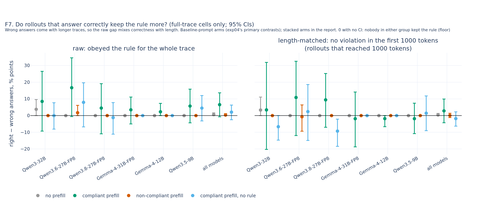

# exp04_prefill: ad hoc answer-correctness check (UNVERIFIED)

Not pre-registered (human request, 2026-09-30). Full-trace cells, 4 opener rules; empty thinking traces are violations at token 0 (v2 scoring). Wrong answers come with longer traces, so read the length-matched columns. Right - wrong in % points; n/a: fewer than 10 rollouts in a group; 0.0 [0.0, 0.0]: nobody in either group kept the rule (a floor, not evidence of no link). Every number is grader-scored (no LLM judge).

| model | arm | n right / wrong | median tokens right / wrong | obeyed throughout: right - wrong | no violation in first 200: right - wrong | no violation in first 1000: right - wrong (n right / wrong) |
|---|---|---|---|---|---|---|
| Qwen3-32B | no prefill | 53 / 47 | 1115.0 / 2715.0 | 3.8 [0.0, 9.6] | -0.5 [-8.6, 6.6] | 3.3 [0.0, 11.1] (30 / 34) |
| Qwen3-32B | compliant prefill | 48 / 52 | 994.0 / 3031.5 | 8.5 [-9.3, 26.5] | -5.6 [-24.2, 14.5] | 3.4 [-20.3, 31.9] (24 / 44) |
| Qwen3-32B | non-compliant prefill | 48 / 52 | 794.0 / 3557.5 | 0.0 [0.0, 0.0] | 0.0 [0.0, 0.0] | 0.0 [0.0, 0.0] (20 / 41) |
| Qwen3-32B | compliant prefill, no rule | 50 / 50 | 1182.0 / 6067.5 | 0.0 [-8.1, 7.7] | 2.0 [-9.7, 14.6] | -6.7 [-14.7, 0.0] (33 / 45) |
| Qwen3-32B | no prefill, stacked | 57 / 43 | 750.0 / 1085.0 | 4.7 [-3.2, 12.9] | 7.6 [-2.7, 18.2] | 4.5 [0.0, 15.8] (22 / 24) |
| Qwen3-32B | compliant prefill, stacked | 47 / 53 | 1049.0 / 1539.0 | 22.8 [3.8, 42.5] | 8.7 [-9.3, 25.6] | 8.3 [-17.4, 34.3] (24 / 40) |
| Qwen3-32B | non-compliant prefill, stacked | 51 / 49 | 757.0 / 1581.0 | 0.0 [0.0, 0.0] | 0.0 [0.0, 0.0] | 0.0 [0.0, 0.0] (21 / 34) |
| Qwen3.6-27B-FP8 | no prefill | 54 / 46 | 4239.0 / 6047.0 | 0.0 [0.0, 0.0] | 0.0 [0.0, 0.0] | 0.0 [0.0, 0.0] (54 / 46) |
| Qwen3.6-27B-FP8 | compliant prefill | 53 / 47 | 2638.0 / 4395.0 | 16.7 [-0.6, 34.6] | 2.9 [-14.7, 20.3] | 10.9 [-12.0, 32.6] (43 / 39) |
| Qwen3.6-27B-FP8 | non-compliant prefill | 58 / 42 | 3184.5 / 5110.5 | 1.7 [0.0, 6.1] | 1.1 [-6.0, 7.8] | -0.7 [-9.3, 6.4] (43 / 33) |
| Qwen3.6-27B-FP8 | compliant prefill, no rule | 59 / 41 | 2949.0 / 6940.0 | 7.9 [-6.8, 19.6] | 20.2 [3.1, 37.6] | 2.4 [-14.9, 18.6] (46 / 39) |
| Qwen3.6-27B-FP8 | no prefill, stacked | 56 / 44 | 3251.5 / 4517.5 | 8.0 [-3.4, 18.4] | 8.8 [-4.8, 21.6] | -2.6 [-10.4, 4.3] (48 / 43) |
| Qwen3.6-27B-FP8 | compliant prefill, stacked | 57 / 43 | 1647.0 / 2070.0 | 11.3 [-7.5, 30.0] | -0.7 [-9.7, 8.0] | 24.2 [1.3, 46.3] (33 / 33) |
| Qwen3.6-27B-FP8 | non-compliant prefill, stacked | 55 / 45 | 1473.0 / 1672.0 | -0.2 [-12.6, 12.6] | -1.5 [-18.6, 13.7] | -6.4 [-26.8, 10.7] (35 / 28) |
| Qwen3.8-27B-FP8 | no prefill | 62 / 38 | 1066.0 / 1895.0 | 0.0 [0.0, 0.0] | -2.6 [-9.1, 0.0] | 0.0 [0.0, 0.0] (32 / 27) |
| Qwen3.8-27B-FP8 | compliant prefill | 54 / 46 | 1310.0 / 3697.0 | 4.5 [-10.9, 19.1] | 6.5 [-15.5, 28.0] | 9.4 [-7.0, 25.2] (31 / 38) |
| Qwen3.8-27B-FP8 | non-compliant prefill | 53 / 47 | 1562.0 / 2098.0 | 0.0 [0.0, 0.0] | 0.0 [0.0, 0.0] | 0.0 [0.0, 0.0] (32 / 36) |
| Qwen3.8-27B-FP8 | compliant prefill, no rule | 55 / 45 | 1905.0 / 5435.0 | -1.2 [-11.1, 7.8] | -1.0 [-14.1, 12.1] | -9.3 [-18.4, -2.1] (38 / 43) |
| Qwen3.8-27B-FP8 | no prefill, stacked | 59 / 41 | 823.0 / 2156.0 | -4.7 [-16.1, 6.2] | -1.3 [-18.9, 14.9] | -4.4 [-21.5, 9.9] (28 / 26) |
| Qwen3.8-27B-FP8 | compliant prefill, stacked | 54 / 46 | 1150.0 / 2610.0 | 1.7 [-17.6, 20.8] | -8.5 [-30.8, 14.1] | -15.4 [-37.6, 6.8] (28 / 38) |
| Qwen3.8-27B-FP8 | non-compliant prefill, stacked | 56 / 44 | 979.0 / 1965.5 | 1.8 [0.0, 6.5] | 5.5 [0.0, 12.5] | 0.0 [0.0, 0.0] (27 / 33) |
| Gemma-4-31B-FP8 | no prefill | 60 / 40 | 2906.0 / 4395.5 | 0.0 [0.0, 0.0] | 0.0 [0.0, 0.0] | 0.0 [0.0, 0.0] (46 / 36) |
| Gemma-4-31B-FP8 | compliant prefill | 64 / 36 | 2817.5 / 4072.0 | 3.5 [-5.0, 11.1] | 2.1 [-18.8, 22.7] | -1.9 [-18.8, 14.1] (47 / 32) |
| Gemma-4-31B-FP8 | non-compliant prefill | 57 / 43 | 2667.0 / 3786.0 | 0.0 [0.0, 0.0] | 0.0 [0.0, 0.0] | 0.0 [0.0, 0.0] (45 / 38) |
| Gemma-4-31B-FP8 | compliant prefill, no rule | 62 / 38 | 4136.0 / 5203.0 | 0.0 [0.0, 0.0] | 0.0 [0.0, 0.0] | 0.0 [0.0, 0.0] (52 / 35) |
| Gemma-4-31B-FP8 | no prefill, stacked | 52 / 48 | 607.5 / 667.0 | 11.4 [2.0, 20.9] | 25.8 [2.6, 50.2] | 0.0 [0.0, 0.0] (18 / 19) |
| Gemma-4-31B-FP8 | compliant prefill, stacked | 59 / 41 | 1121.0 / 1990.0 | 18.0 [1.1, 35.9] | 11.6 [-2.6, 26.0] | -7.3 [-28.4, 15.0] (33 / 32) |
| Gemma-4-31B-FP8 | non-compliant prefill, stacked | 57 / 43 | 952.0 / 1394.0 | -1.1 [-9.0, 6.5] | -4.6 [-14.3, 6.0] | -3.3 [-10.3, 0.0] (28 / 30) |
| Gemma-4-12B | no prefill | 43 / 57 | 5116.0 / 9652.0 | 0.0 [0.0, 0.0] | 0.0 [0.0, 0.0] | 0.0 [0.0, 0.0] (38 / 56) |
| Gemma-4-12B | compliant prefill | 44 / 56 | 4948.5 / 10175.0 | 2.3 [0.0, 7.3] | 1.6 [-13.5, 16.7] | -1.8 [-6.7, 0.0] (39 / 55) |
| Gemma-4-12B | non-compliant prefill | 43 / 57 | 4962.0 / 11963.0 | 0.0 [0.0, 0.0] | 0.0 [0.0, 0.0] | 0.0 [0.0, 0.0] (40 / 57) |
| Gemma-4-12B | compliant prefill, no rule | 48 / 52 | 6720.0 / 12497.5 | 0.0 [0.0, 0.0] | 0.0 [0.0, 0.0] | 0.0 [0.0, 0.0] (46 / 52) |
| Gemma-4-12B | no prefill, stacked | 41 / 59 | 1568.0 / 3664.0 | 2.4 [0.0, 7.9] | 3.2 [0.0, 11.1] | 0.0 [0.0, 0.0] (23 / 42) |
| Gemma-4-12B | compliant prefill, stacked | 46 / 54 | 1209.5 / 11037.0 | 10.0 [-1.9, 22.6] | -4.6 [-21.2, 12.0] | -4.2 [-16.7, 8.4] (28 / 44) |
| Gemma-4-12B | non-compliant prefill, stacked | 41 / 59 | 1457.0 / 6503.0 | 2.4 [0.0, 7.9] | 2.4 [0.0, 7.9] | 0.0 [0.0, 0.0] (23 / 54) |
| Qwen3.5-9B | no prefill | 50 / 50 | 7420.0 / 10125.5 | 0.0 [0.0, 0.0] | 0.0 [0.0, 0.0] | 0.0 [0.0, 0.0] (49 / 50) |
| Qwen3.5-9B | compliant prefill | 51 / 49 | 2322.0 / 4650.0 | 5.7 [-4.3, 15.8] | -3.2 [-21.9, 14.6] | -1.8 [-10.8, 7.4] (33 / 41) |
| Qwen3.5-9B | non-compliant prefill | 49 / 51 | 2987.0 / 3521.0 | 0.0 [0.0, 0.0] | 0.0 [0.0, 0.0] | 0.0 [0.0, 0.0] (30 / 38) |
| Qwen3.5-9B | compliant prefill, no rule | 47 / 53 | 2670.0 / 6843.0 | 4.5 [-3.2, 12.0] | 0.1 [-16.7, 15.5] | 1.4 [-9.0, 11.8] (39 / 48) |
| Qwen3.5-9B | no prefill, stacked | 50 / 50 | 7386.0 / 8326.0 | 0.0 [0.0, 0.0] | 0.0 [0.0, 0.0] | 0.0 [0.0, 0.0] (50 / 50) |
| Qwen3.5-9B | compliant prefill, stacked | 41 / 59 | 1491.0 / 3158.0 | 6.9 [-8.4, 23.9] | 3.2 [-18.5, 23.2] | -6.8 [-14.5, 0.0] (23 / 44) |
| Qwen3.5-9B | non-compliant prefill, stacked | 51 / 49 | 1692.0 / 4370.0 | 0.0 [0.0, 0.0] | 0.0 [0.0, 0.0] | 0.0 [0.0, 0.0] (32 / 38) |
| all models | no prefill | 322 / 278 | 3219.5 / 5895.0 | 0.6 [0.0, 1.6] | -0.5 [-2.0, 0.9] | 0.4 [0.0, 1.3] (249 / 249) |
| all models | compliant prefill | 314 / 286 | 1996.0 / 4585.0 | 6.6 [-0.7, 13.6] | 2.2 [-8.4, 12.8] | 2.8 [-4.3, 9.9] (217 / 249) |
| all models | non-compliant prefill | 308 / 292 | 2236.5 / 5431.0 | 0.3 [0.0, 1.2] | 0.3 [-0.8, 1.5] | 0.1 [-1.2, 1.4] (210 / 243) |
| all models | compliant prefill, no rule | 321 / 279 | 2869.0 / 6432.0 | 2.1 [-2.5, 6.3] | 3.5 [-3.5, 9.9] | -1.8 [-6.3, 2.2] (254 / 262) |
| all models | no prefill, stacked | 315 / 285 | 1861.0 / 3400.0 | 4.2 [0.3, 7.7] | 8.0 [2.2, 13.6] | -0.3 [-3.4, 2.5] (189 / 204) |
| all models | compliant prefill, stacked | 304 / 296 | 1149.5 / 2558.0 | 13.9 [4.5, 23.5] | 4.9 [-5.4, 13.9] | 2.7 [-6.7, 13.1] (169 / 231) |
| all models | non-compliant prefill, stacked | 311 / 289 | 1109.0 / 2428.0 | 0.8 [-1.7, 3.8] | 1.0 [-2.0, 4.2] | -0.4 [-3.8, 2.7] (166 / 217) |

- [F7_correctness_check](../../../../figures/exp04_prefill/adhoc_correctness/F7_correctness_check.html) 

Status: UNVERIFIED until a human adds it to VERIFIED.md
