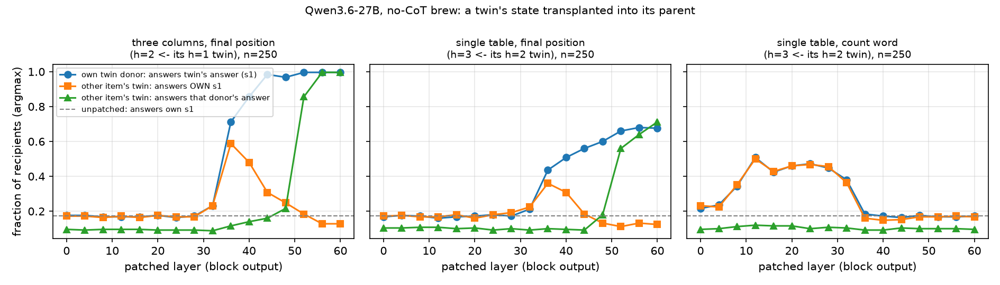

# Wrong no-CoT brew answers: the first lookup is made, no composed colour is found, and the answer position only sets the stir count

**Status: UNVERIFIED** until a human adds it to `VERIFIED.md`. Model: Qwen3.6-27B (bf16, thinking off, "Answer:"
prefilled), read with the released J/R lenses. Pre-registration: `manifest.json` (questions, groups, reading rules),
its two deviations and the `test_addendum` (probe settings, Q3 tests and their reading rules), all committed before
any test capture. Outputs: `analysis/test_v1/` (`test_analysis.txt` = every pre-registered test number;
`exploratory_*.txt` = the follow-ups marked exploratory below; `fig_twinpatch.png`). Raw outputs:
`cache/exp11/q23_*.pt` (private HF dataset). No item text appears anywhere.

## TL;DR

The question (project idea 1): when a model gets a no-CoT multi-step item wrong, is the right intermediate computed
somewhere and then lost, or never computed?

1. **The dominant error is a shortcut, not noise.** With three ingredient columns and two stirs, the model is right
   12% of the time; 164 of 250 answers apply only the *last* stir to the start colour (75% of errors; permutation
   null 11%). With a single table, three stirs, errors are miscounts in both directions (41 one stir short, 66 one
   or more extra, of 162).
2. **The first-stir colour s1 is not at the answer position when the model shortcuts** (pre-registered reading
   "never_computed"), but this test has little power: the probe finds no s1 there on correct items either, and in
   the probed band even the model's own eventual answer is only weakly decodable (0.26; chance 0.10).
3. **Exploratory: s1 *is* looked up locally at the first ingredient's token** (probe s1-minus-decoy +0.13
   [+0.07,+0.20] on shortcut items, about the size of the same lookup on one-stir items, +0.08), before the model
   has seen the second stir. It is not found at the second ingredient's token, the question end or the answer.
4. **No answer-position patch rescues a wrong answer**: neither the item's own later state written into an earlier
   layer, nor a correct item's state at layer 40. Both are clean nulls against matched controls.
5. **What the answer position carries at layers 36–40 is a stir-count setting, not a colour.** An unrelated item's
   one-stir state, written in there, makes the model answer *its own* first-stir colour (0.59 at layer 36; the
   donor's colour 0.12); the colour itself arrives only from layer 52. Two-stir donors do not do this, so it is the
   donor's count, not disruption. The single table shows the same, and its count word ("twice") is a generic,
   item-independent quantity read between layers 12 and 32.

Reading: the answer position decides *how many* stirs to apply and then fetches a colour from the prompt. In
shortcut items the first lookup exists locally, but no composed colour (s1 fed into the second lookup) is found
anywhere downstream, and a correct item's answer-position state does not supply one. So the failure is in the
prompt positions' computation, not in a value the answer position held and lost. "Computed, then lost" is not
supported; "never computed" fits the composition (we never find it), not the first lookup (we do).

## Setup

**Task** (brew, nocot-bench's instruction and colours, our own generator and seeds): a potion starts one colour;
each stir maps colour to colour via a per-item random table; answer the final colour, no CoT. Two table formats:
- *Three columns*: three ingredients, each with its own map ("A red potion turns blue with dew, green with soot,
  white with clay."); stirs name ingredients ("You stir in, one at a time: dew, then clay.").
- *Single table*: one map, stirred h times ("You stir it three times.").

**Banks** (test, 250 items per depth h = 1, 2, 3 per format): the pre-registered three-column bank, a single-table
bank, and *twins*: each parent with its last stir removed (h=2 → h=1 for three columns; h=3 → h=2 for the single
table), same table and start, only the stir sentence changes.

**Groups** (three columns, h=2): *correct*; *shortcut* (the start colour under the last ingredient, skipping the
first stir); *other_wrong*. Single table: *correct*, *one_short*, *one_extra*, *other_wrong*.

**Readouts.** Layer l = the output of block l. Probe: 10-way logistic regression per layer, 5-fold held out,
s1-minus-decoy accuracy (the decoy is the start colour's entry under the unused ingredient, so both labels are on the
same rule line). Lenses: J-lens (primary) and R-lens margins. Patching: replace one position's residual at one layer
and read the 10 colour logits.

## Results

### 1. Behaviour (Q1)

| format | h=1 | h=2 | h=3 |
|---|---|---|---|
| three columns | 1.00 | 0.12 | 0.05 |
| single table | 1.00 | 0.76 | 0.35 |

Three columns, h=2: 220 wrong, of which 164 shortcut ("last stir only" 0.75 of errors vs 0.11 under the
permutation null). The 30 correct items are not luck: among the 86 non-shortcut answers 35% are right (a random
choice among the 9 non-shortcut colours: 11%), and even on shortcut items the gold gets more probability than the
other wrong colours (0.069 vs 0.037 each; `exploratory_checks.txt`). Three columns with the *same* ingredient twice (dev): 0.38, so the cost comes
both from the three-column lookup and from composing different ingredients.

Single table, h=3 (162 wrong): −1 stir 41, +1 31, +2 20, +3 15, −2/−3 4, off the start's cycle 51.

### 2. Is the first intermediate in the residual stream? (Q2, three columns)

Pre-registered primary (probe, answer position, band 24..52): guard (h=1 answer-minus-decoy) +0.48 [+0.45,+0.51];
shortcut s1-minus-decoy **+0.017 [−0.036,+0.067]** → *never_computed*. Correct group −0.096 [−0.227,+0.047] (n=19),
other_wrong −0.006. The secondary probe positions (second ingredient −0.010, question end +0.044) and the confident
subset (+0.021) agree; the lens margins at the answer position show no consistent s1 signal before the late-layer
rule-line artefact (layers 56–60).

Why this reading is weak (most likely confound first):
- **No power where it should succeed.** The correct group, which must have used s1 somewhere, is not above threshold
  either, and the guard is weak by construction: at h=1 the "intermediate" is the output.
- **The band precedes any colour at the answer position.** At h=2 the probe decodes the model's own eventual answer
  at only 0.26 in this band (0.65 at h=1); the twin patches below put the colour's arrival at layer 52. So the
  answer position may simply hold no colour yet, s1 or otherwise.
- **The dev effect did not replicate.** Dev (n=61 shortcut) gave +0.067 [+0.014,+0.120]; test gives +0.017.

**Exploratory (not pre-registered; chosen after seeing the secondary lens margins): the first ingredient's token.**
Probe s1-minus-decoy, shortcut **+0.132 [+0.065,+0.202]** (n=107), correct +0.118 [−0.044,+0.291] (n=19), h=1
reference (the same lookup) +0.080 [+0.041,+0.119]; J/R-lens agree (shortcut +0.51/+0.48 at layer 40). On the
independent dev items: shortcut +0.060 [+0.004,+0.124] (a weaker probe: start colour 0.71 vs 0.93). Checked
confound: column order is balanced (if anything the decoy's column is listed first more often, which works against
this). Note the timing: at this token the model has not read the second stir, so this is an automatic local lookup,
not evidence about the decision to shortcut.

### 3. Single table: is the colour before the answer held? (Q2, J-lens, answer position, band 36..48)

- *Held predecessor* (pre-registered): D = margin(colour that maps to the answer) − margin(answer), h=3 correct
  **+0.48 [+0.32,+0.64]** → met. one_short −0.01 [−0.29,+0.26], other_wrong +0.02, one_extra +0.28 [+0.00,+0.56].
- *Held state predicts correct vs one_short* (pre-registered): AUC(R) **0.59 [0.48,0.70]** → **not met** on the
  primary lens (AUC(R) − AUC(A) CI [+0.05,+0.41] would pass). R-lens (secondary): AUC(R) 0.67 [0.57,0.77], passes.
- Falsification flag on D: at h=2, D is positive in every group with n > 3, including off-cycle wrong answers
  (+0.51 [+0.20,+0.81], n=26). So D alone cannot separate a held trajectory state from reading the answer's own
  rule line; only the h=3 group contrast is informative, and its pre-registered test fails on the primary lens.

### 4. Causal tests (Q3)

| test | primary cell | treatment vs control | reading |
|---|---|---|---|
| back-patch own later state into earlier layer (three, shortcut, n=164) | 32 ← 48 | 0.098 vs 0.091, +0.006 [−0.037,+0.043] | no rescue |
| transplant a correct item's answer state (three, shortcut, n=164) | layer 40 | 0.067 vs 0.073, −0.006 [−0.043,+0.030] | no rescue |
| same (single, one_short, n=41) | layer 40 | 0.024 vs 0.049, −0.024 [−0.098,+0.000] | no rescue |
| write own one-stir twin's state into the answer position (three, n=250) | best of 36..48 | gold −0.096 [−0.136,−0.060] vs unpatched | no composition |

The 9% "rescue" in both arms of the back-patch is what scrambling an answer onto one of nine colours gives.

**Twin write-in (figure).** Lines in `fig_twinpatch.png` (the legend names the first panel's state, s1; the
single-table panels show the same lines for s2): blue = own twin as donor, the model answers the twin's answer;
orange = another item's twin as donor, the model answers the colour *its own* twin would; green = that donor's
answer; dashed = unpatched.

- *Three columns, answer position*: setting window **layers 36–40** (own s1 0.59/0.48 vs donor's 0.12/0.14), colour
  arrival **layer 52** (0.86). Check against disruption: two-stir donors (the mode-transplant controls) at layer 36
  leave shortcut items on their own s1 at 0.19–0.21 (0.15 at layer 32, where no patch has an effect; s1 equals the
  shortcut answer on 0.12 of these items), while one-stir donors move them to 0.49. It is the donor's stir count
  (`exploratory_checks.txt`).
- *Single table, answer position*: setting window 36–40 (own s2 0.36/0.31 vs 0.10), colour arrival 52. Reverse
  (adding a stir: three-stir state into a two-stir item): no setting window (own s3 ≤ 0.20 vs 0.09), so the effect is
  asymmetric.
- *Single table, count word*: "twice" into a three-stir item raises the twice-answer from 0.17 to **0.51 at layer
  12**, effective through 32, gone from 36; another item's "twice" does the same (+0.008 [−0.012,+0.028]) →
  item-independent count, read out by layer 32. Reverse ("three times" into "twice") peaks at layer 8 (+0.23) with a
  second bump at 28–32 (unexplained; exploratory).

## What this does and does not show

- Supported (causal, matched controls, replicated dev → test): the answer position at layers 36–40 holds an
  item-independent stir-count setting, and the colour is fetched from the prompt only from ~52; wrong answers are
  not rescued by any answer-position state we tried (the item's own later states, a correct item's state).
- Not shown: that s1 is "never computed". It is computed locally (exploratory), and our answer-position probe could
  not have found it even where it was used.
- Inferred, not directly shown: that the failure sits in the prompt positions. It rests on a null (a correct item's
  answer-position state at layers 28–52 does not rescue) plus the absence of s1 at the second ingredient's token;
  a positive test would patch prompt-position states from correct items, which we did not run.
- One model, one task family, no CoT. Lens readouts are suggestive; the probe and patching numbers are the hard
  evidence. No LLM-judge scores are used.

## Open

- Does s1 move anywhere after the first ingredient's token on correct items? (A per-position probe over all tokens
  between the first ingredient and the answer; n=19–30 correct items is the limit.)
- The positive test of "the failure is in the prompt positions": patch the second ingredient's token (and the
  tokens after it) from a correct item with the same start, first stir and table rows into a shortcut item.
- Patch s1's local state (first ingredient's token) from a twin into a shortcut item: does the answer move?
- The second bump in the reverse count patch.
